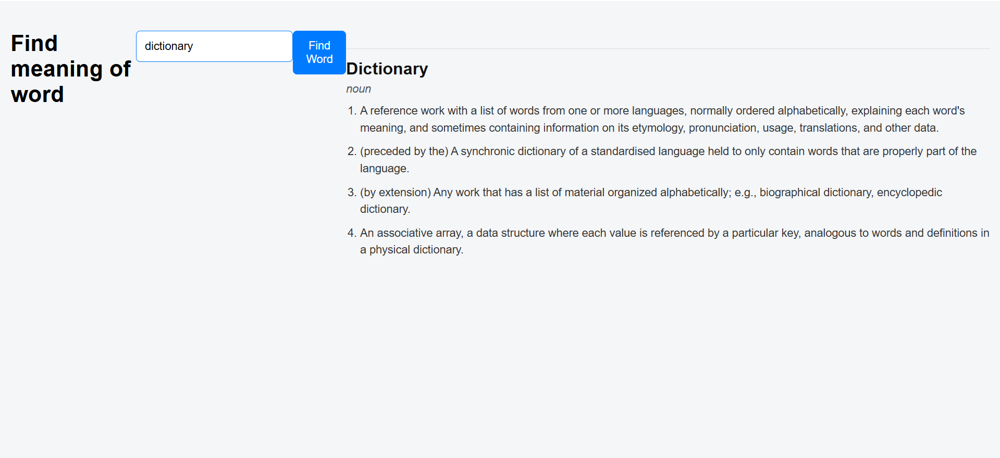

# 📘 Dictionary Search App

A simple **Dictionary Web App** built using **HTML, CSS, JavaScript** and a **free Dictionary API**.  
It allows users to search any English word and view its meanings instantly.

---

## ✨ Features
- 🔍 Search meaning of a word
- 📝 Multiple definitions support
- ⌨️ Enter key search
- ⏳ Loading indicator
- ❌ Error handling (word not found / network error)

---

## 🛠 Tech Stack
- HTML  
- CSS  
- JavaScript (Vanilla)  
- Axios  
- Free Dictionary API  

```
https://api.dictionaryapi.dev/
```

---

## 📂 Project Structure
```
Dictionary_search/
├── index.html
├── style.css
├── app.js
├── image2.png
└── README.md
```

---

## 🖼 App Preview


---

## ▶️ How to Run
1. Open `index.html` in browser  
2. OR use **VS Code Live Server**

---

## 🎯 What I Learned
- Async / Await
- API calling using Axios
- JSON data handling
- DOM manipulation
- Real-world API usage

---

## 🚀 Future Improvements
- Pronunciation audio support
- Synonyms & antonyms
- Better UI styling
- Mobile responsive design
