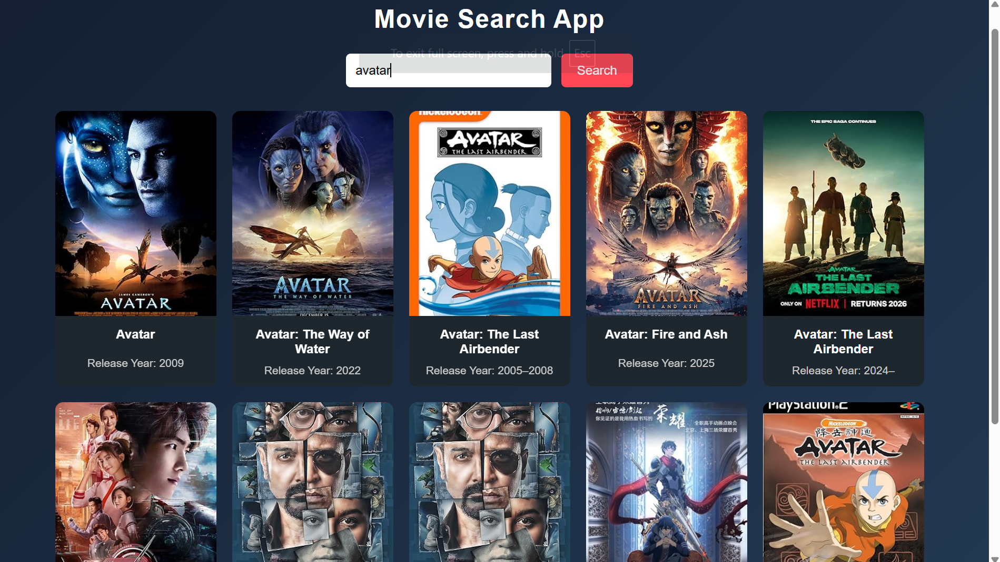

# 🎬 Movie Search App

A movie search application built using **JavaScript**, **OMDb API**, and **Axios** that allows users to search for movies and view results in a clean, card-based UI.

---

## 🚀 Features

- Search movies by name
- Displays movie poster, title, and release year
- Real-time API data fetching using async/await
- Keyboard (Enter key) support
- Responsive card-based UI
- Error handling for empty search & invalid results

---

## 🛠️ Tech Stack

- HTML5  
- CSS3  
- JavaScript (ES6+)  
- Axios  
- OMDb API  

---

## 📸 Preview

---

## 📚 What I Learned

- Working with public APIs (OMDb)
- Using async/await for API calls
- Handling API responses and errors
- DOM manipulation and dynamic UI rendering
- Creating reusable and readable JS functions

---

## 🔗 API Used

- OMDb API  
  https://www.omdbapi.com/

---

## 📂 Project Structure

